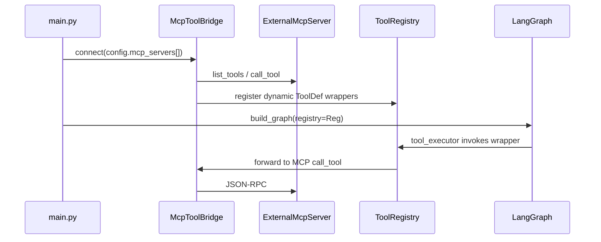

# MCP integration spike — evaluation

> **Status:** Spike / design only (2026-06-03). **Not implemented.**  
> **Context:** LingjiPlan 生态评估 — Tier B bridge before Sprint 13 plugin platform.

## Goal

Connect external [Model Context Protocol (MCP)](https://modelcontextprotocol.io/) servers to Lingji's `ToolRegistry` so contributors can expose tools without merging into core `execution/tools/`.

## Current state

| Item | Status |
|------|--------|
| In-process `@registry.register` | ✅ 9 built-in tools |
| MCP client in Agent | ❌ |
| Dynamic tool load from config | ❌ |
| Sprint 13 Sidecar + Manifest | ❌ design only |

## Proposed architecture (minimal)

### Integration points

| Location | Change |
|----------|--------|
| `foundation/config.py` | Optional `mcp.servers: [{name, command, args, env}]` |
| New `execution/mcp_bridge.py` | Spawn stdio MCP client (e.g. `mcp` Python SDK); map MCP tool schema → OpenAI function schema |
| `main.py` | After built-in imports, `await mcp_bridge.load_into(registry)` |
| `orchestrator.py` | No change if wrappers are normal `ToolDef` with chosen `RiskLevel` |
| HITL / sandbox | **Policy:** default MCP tools `WARN`; opt-in `CRITICAL` via config allowlist |

### Risk / security

- MCP tools run **in the MCP server process**, not Lingji sandbox — trust model differs from `execute_command`.
- Must document: connecting untrusted MCP servers is equivalent to installing untrusted code.
- Sanitizer / Guardrails still apply to user messages; tool **outputs** should pass through output sanitizer if added later.

## Effort estimate

| Phase | Scope | Estimate |
|-------|--------|----------|
| Spike | Single stdio server, 1–2 tools, unit test with mock | 3–5 days |
| MVP | Config YAML, reconnect, schema refresh | +1 week |
| Production | HITL policy, timeouts, OTel spans, red-team cases | +2 weeks |

**Dependency:** add `mcp` (official Python SDK) to optional extras, e.g. `pip install lingji-agent[mcp]`.

## Alternatives considered

| Approach | Pros | Cons |
|----------|------|------|
| **MCP client (recommended Tier B)** | Industry standard; reuse existing servers | New dependency; trust boundary docs |
| YAML `tools.modules: [...]` import paths | No new protocol; stays in-process | Still requires Python code on disk; no isolation |
| Sprint 13 Sidecar + Manifest | Strong isolation; patent 6 | 8–12+ weeks; overkill for first OSS release |

## Recommendation

1. **Now (Tier A):** document in-process tools — [examples/custom_tool](../examples/custom_tool/) + [CONTRIBUTING.md](../CONTRIBUTING.md).
2. **After public mirror v0.1:** implement MCP spike if community asks for external integrations.
3. **Later (Tier C):** Sprint 13 only if product needs marketplace + isolation guarantees.

## Acceptance criteria (if implemented)

- [ ] Config lists one MCP server; Agent startup registers N tools
- [ ] `pytest` covers mock MCP server round-trip
- [ ] README states MCP trust model; no claim of plugin marketplace
- [ ] CRITICAL MCP tools respect HITL when configured

## Out of scope for this spike

- MCP **server** exposing Lingji tools to Claude Desktop
- Plugin Registry / `lingji.plugin.yaml`
- WASM / microVM runtimes
