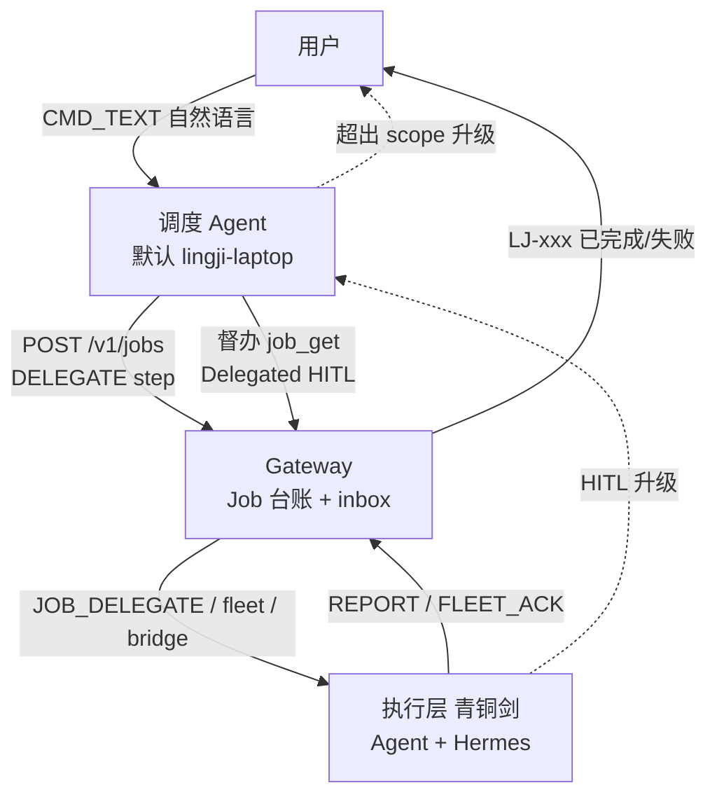

# Sprint Fleet 4.0d — 离沪值守、委派审批与 Hermes 权限代理

> **状态**：设计定稿（2026-07-08）· **未编码**  
> **前置**：Fleet 4.0a Job 台账（`6d73ff4`+）；upload fast-path 修复（`65d37d1`）  
> **关联**：[fleet-4.0-job-workflow.md](./fleet-4.0-job-workflow.md) · [fleet-4.0d-remote-guardian-runbook.md](./fleet-4.0d-remote-guardian-runbook.md) · 完整 Sprint 见 LingjiPlan `docs/sprints/…/Sprint Fleet 4.0d …`

---

## 1. 背景与动机

### 1.1 用户场景（离沪值守）

| 设备 | 角色 | 物理位置 |
|------|------|----------|
| **青铜剑** `lingji-pc` | **值守执行机**（Agent + Hermes + 文件/环境） | 上海，不可带走 |
| **空城记** `lingji-laptop` | **调度终端**（随用户移动） | 广东等 |
| **手机 Web** | **入口**（与空城记等价 user_id） | 随用户移动 |

**产品铁律：**

```text
用户 ──对话──→ 调度灵机 Agent（唯一对话面，对用户负责）
                    ↓ 委派 Job / step
              青铜剑执行层（Agent 工具 + Hermes playbook，对调度层负责）
                    ↓ REPORT
              Gateway Job 台账 ──结案──→ 用户
```

**禁止作为主路径：**

- 用户 → 直接 @Hermes（跳过调度 Agent）
- 用户 → Web 手选「青铜剑」当聊天对象（青铜剑是执行机，不是参谋）

Hermes 直聊仅作 **break-glass 运维**（调度 Agent 与 Gateway 均不可用），不进产品设计。

### 1.2 批准权痛点

| 通道 | 现状 | 离沪问题 |
|------|------|----------|
| **灵机 HITL**（CRITICAL 工具） | Web HITL dock；`hitl_timeout_sec` 超时拒绝 | 批准对象是**用户**，非调度 Agent；连环 `execute_command` 不稳定 |
| **Hermes 本机 UI** | Allow once / Allow for mission；**绑定本地键盘/会话** | 用户在广东**碰不到上海键盘** → 易死锁 |
| **Hermes MCP Bridge** | `permissions_list_open` + `permissions_respond` | 可程序化批，但需 bridge 常驻 + 与 Job scope 对齐 |

### 1.3 设计目标

1. **用户只和调度 Agent 聊**，体验对齐 GPT/千问；调度 Agent 对意图与结案负责。  
2. **执行机权限在 Job 范围内放松**；范围外由调度 Agent 代批或升级用户。  
3. **Hermes 审批不依赖上海键盘**；走 Mission 预授权 + Permission Proxy。  
4. **任何等待必有 TTL、可见状态、失败结案**（`LJ-xxx failed`），禁止无声挂起。

---

## 2. 角色与责任链（定稿）



| 关系 | 责任 |
|------|------|
| **用户 → 调度 Agent** | 下意图；收一句话结案；必要时批 **Mission 范围**（一级授权） |
| **调度 Agent → 执行层** | 建 Job、写 `approval_scope`、委派 step、代批范围内三级 HITL/Hermes 权限 |
| **执行层 → Gateway** | 结构化 REPORT；不私自 mint `LJ-*`；不绕过台账对用户聊天结案 |
| **执行层 → 用户** | **禁止直连**（除 Gateway 转发的进度/结案事件） |

### 2.1 调度 Agent 绑定（离沪配置）

| 配置项 | 离沪推荐值 | 说明 |
|--------|------------|------|
| `scheduler_agent_id` | **`lingji-laptop`（空城记）** | 随用户在线，专职接话与督办 |
| `guardian_executor_id` | **`lingji-pc`（青铜剑）** | 值守执行面，7×24 |
| Web `target_agent_id` 默认 | **`lingji-laptop`** | UI 文案：「调度 · 空城记」 |
| 青铜剑 Web 下拉 | 标「上海 · 执行机（勿直聊）」或调试模式隐藏 | 防误选 |

> Fleet 4.0 原稿默认调度为 `lingji-pc`；**离沪场景以本文为准**，实现时支持 `LINGJI_SCHEDULER_AGENT_ID` 环境变量覆盖。

---

## 3. 三级批准模型

### 3.1 级别对照

| 级别 | ID | 批准者 | 场景 |
|------|-----|--------|------|
| **一级** | `LJ-*` Job | **用户**（对话确认或隐式交办） | 「帮我在上海电脑更新代码并重启」 |
| **二级** | `approval_scope`（Job 内字段） | **用户一次授权 / 调度 Agent 写入** | Mission 内命令、路径、playbook 白名单 |
| **三级** | HITL `task_id` / Hermes permission id | **调度 Agent 代批**；超 scope **升级用户** | 单步 CRITICAL、Hermes allow-once |

### 3.2 策略 A — Mission 预授权（`approval_scope`）

创建 Job 时，调度 Agent 写入：

```yaml
approval_scope:
  expires_at: "2026-07-08T14:00:00Z"   # 默认：Job TTL 或 1h
  playbooks:                          # Tier 0 白名单
    - agent.restart
    - agent.status
    - git-pull-deploy
    - fleet-smoke
  allowed_paths:                      # 路径前缀
    - /mnt/e/LingjiPlan/LingjiZero
  allowed_commands:                   # 可选；playbook 内固定则不必
    - git pull
    - ./scripts/restart-agent-wsl.sh
  fleet_targets:                      # 跨机目标
    - lingji-pc
  auto_approve_tier0: true            # Hermes playbook 默认 true
  auto_approve_hitl_in_scope: true    # 三级在 scope 内由调度代批
```

**效果：**

- scope 内 Tier 0 playbook → **不弹 Hermes 本机 Allow**（或 bridge 自动 `allow-once`）
- scope 内 WARN 工具（如 `fleet_send_file`）→ 免 HITL（敏感路径仍拦）
- scope 内 CRITICAL → **Delegated HITL**（见 3.3），不默认找用户

### 3.3 策略 B — Delegated HITL（调度 Agent 代批）

**现状（4.0a）：** `HITL_REQ` → `target_user_id` fan-out → 用户 Web dock 批准。

**目标（4.0d）：**

```text
执行机 LangGraph interrupt（三级）
  → HITL_REQ 增加 job_id, step_id, escalation: scheduler | user
  → escalation=scheduler → 路由至 scheduler_agent_id 的 Agent inbox
  → 调度 Agent 运行 hitl_delegate_respond(task_id, decision, reason)
       · 在 approval_scope 内 → approved（写 evidence）
       · 超出 scope / 敏感 → 升级 escalation=user（用户 Web dock）
  → Gateway 转发 HITL_RES 至执行机 thread，续跑
```

**Gateway `HITL_REQ` payload 扩展：**

```json
{
  "task_id": "…",
  "description": "执行 execute_command(…)",
  "risk_level": "critical",
  "job_id": "LJ-A1B2C3D4",
  "step_id": "LJ-A1B2C3D4-S2",
  "escalation": "scheduler",
  "scheduler_agent_id": "lingji-laptop",
  "approval_scope_hash": "sha256:…"
}
```

**调度 Agent 工具（新增）：**

| 工具 | 作用 |
|------|------|
| `hitl_list_pending` | `GET /v1/hitl/pending?agent_id=lingji-laptop&job_id=` |
| `hitl_delegate_respond` | 代批/拒绝；写 Job step evidence |

**Prompt 规则（调度 Agent）：**

- 用户已交办且 step 在 `approval_scope` 内 → **默认 approve**，勿反复询问用户。  
- 涉及 `~/.ssh`、凭证路径、scope 外路径 → **reject 或升级 user**。

### 3.4 策略 C — Hermes Permission Proxy

**事实：** Hermes **本机 UI** 的 Allow once/mission **不能**异地键盘代点；**MCP Bridge** 可程序化响应。

Bridge 工具（已存在于 Hermes MCP）：

- `permissions_list_open` — 当前 bridge 会话内挂起审批  
- `permissions_respond(id, decision)` — `allow-once` | `allow-always` | `deny`

**4.0d 执行流程（step 类型 `hermes_playbook`）：**

```text
1. 调度 Agent job_invoke_hermes(target=lingji-pc, playbook=agent.restart, job_id=LJ-xxx)
2. Gateway 转发至青铜剑 Hermes bridge listener
3. 并行 watcher（调度 Agent 侧或青铜剑 lightweight daemon）：
     loop:
       pending = permissions_list_open()
       for each in pending:
         if matches approval_scope → permissions_respond(allow-once)
         elif timeout_sec exceeded → deny + REPORT step failed
4. Playbook 结束 → POST .../report completed
5. Gateway → 用户 LJ-xxx 已完成
```

**Bridge 限制（文档化，勿过度承诺）：**

- 仅 **bridge 连接期间** 的 live-session 审批可见；bridge 重启前的旧单不包含。  
- 故 **值守机必须 bridge 常驻 + 健康检查**；挂则 Job step failed + 告警。

**与「Allow for this mission」对齐：** Job 的 `approval_scope` **等价于** mission 边界；由调度 Agent 在 Gateway 台账写入，而非上海键盘点一次。

---

## 4. 权限放松矩阵

| 操作 | Tier | 执行机默认 | Job scope 内 | scope 外 |
|------|------|------------|--------------|----------|
| Hermes playbook（固定脚本） | 0 | 免批 | 免批 | 需 Job + 调度委派 |
| `fleet_send_file` | 1 WARN | HITL 可选 | 免批（非敏感路径） | 调度代批或用户 |
| `move_file` / `read_file` | 1 SAFE/WARN | 按现有 risk | scope 路径内免批 | 升级 |
| `execute_command` | 1 CRITICAL | HITL→用户 | **Delegated HITL** | 升级用户 |
| 敏感路径（`~/.ssh` 等） | — | **始终拦** | **始终升级用户** | 用户 |

**执行机能力裁剪（值守机）：**

- 青铜剑 **不应** 作为用户对话入口开放通用 `execute_command` 连环运维。  
- 运维走 **Tier 0 playbook**；对话走 **调度 Agent 委派 Job**。

---

## 5. 防死锁与任务反馈

### 5.1 等待点与 TTL

| 等待点 | 默认 TTL | 超时动作 | 用户可见 |
|--------|----------|----------|----------|
| 三级 HITL（Delegated） | `hitl_timeout_sec`（300s） | reject → step failed | `LJ-xxx 失败：step S2 审批超时` |
| 三级 HITL（升级用户） | 同上 | reject | Web HITL dock + 失败结案 |
| Hermes permission pending | `hermes_permission_timeout_sec`（120s，新配置） | deny + step failed | 同上 |
| Job step `dispatched` 无 REPORT | `step_dispatch_timeout_sec`（1800s） | step failed → 一级 failed | `LJ-xxx 失败：执行机无回执` |
| 一级 Job 整体 | `job_ttl`（24h） | cancelled / failed | 摘要推送 |

**原则：** 禁止仅呼吸灯「仍在运行…」无 Job 事件；每条 Job 终态必达 `completed | failed | cancelled`。

### 5.2 反馈事件（`JOB_EVENT` 或 AGENT_RES 进度）

| 事件 | 文案示例 | 受众 |
|------|----------|------|
| `job.created` | `LJ-xxx 已创建` | 用户（可选，默认静默） |
| `job.running` | `LJ-xxx 执行中（S2 locate_and_upload）` | 用户 |
| `step.waiting_scheduler_hitl` | `LJ-xxx 等待调度确认（S2）` | **仅运维日志**，不打扰用户 |
| `step.waiting_user_hitl` | `LJ-xxx 需您批准（S2：…）` | 用户 Web dock |
| `step.waiting_hermes_permission` | `LJ-xxx 等待 Hermes 权限（S2）` | 运维日志；超时则 failed |
| `job.completed` | `LJ-xxx 已完成。…` | 用户 |
| `job.failed` | `LJ-xxx 失败：…` | 用户 |

### 5.3 死锁场景与对策

| 场景 | 对策 |
|------|------|
| Hermes 本机 UI 等人点 Allow | **主路径禁止**；仅 playbook + Permission Proxy |
| Bridge 未启动 | 启动时自检；`job_invoke_hermes` 前 `GET /health/hermes-bridge`；失败则 step failed |
| 调度 Agent 离线 | Gateway 排队 CMD；Job step 超时 failed；break-glass Hermes |
| 执行机 HITL 续跑丢 state | 已有 `_notify_hitl_resume_lost`；4.0d 加 Job step `failed` |
| 用户长期不批 | HITL timeout → failed → 可重试新 Job |

---

## 6. 离沪值守 Runbook（Hermes 执行清单）

### 6.1 上海青铜剑（执行机）

1. 电源：**不休眠**（或 WoL + 智能插座；优先常开关屏）  
2. WSL Agent：**开机自启**（`restart-agent-wsl.sh` / systemd）  
3. Hermes MCP Bridge：**常驻**（与 Cursor/Hermes 同机）  
4. `display_name: 青铜剑`；`incoming_dir` 已配置  
5. 每日：`agent.status` playbook 或 `prod-e2e-smoke.py --section basic`  

### 6.2 空城记（调度终端）

1. 随用户携带；Web 默认连 **调度 · 空城记**  
2. `scheduler_agent_id=lingji-laptop`（实现后写入 config）  
3. 用户 **只与此 Agent 对话**  

### 6.3 广东模拟验收（离沪前）

| # | 操作 | 期望 |
|---|------|------|
| 1 | 手机 Web → 调度 Agent：「把文件发到上海青铜剑」 | `LJ-xxx 已完成`；青铜剑 incoming 有文件 |
| 2 | 「检查上海 Agent 状态」 | playbook → REPORT → 结案 |
| 3 | 「pull 最新代码并 restart 上海 Agent」 | scope 内免用户逐条 HITL |
| 4 | 人为断 bridge 5min | `LJ-xxx 失败` + 明确原因，非无限挂起 |

---

## 7. API 与配置扩展（设计）

### 7.1 Job 创建扩展

`POST /v1/jobs` 增加可选字段：

```json
{
  "approval_scope": { "…": "见 3.2" },
  "scheduler_agent_id": "lingji-laptop",
  "guardian_executor_id": "lingji-pc"
}
```

### 7.2 HITL 扩展

- `HITL_REQ` / `GET /v1/hitl/pending` 支持 `scheduler_agent_id`、`job_id` 过滤  
- `POST /v1/hitl/respond` 增加 `responded_by: scheduler | user`  

### 7.3 Hermes bridge（4.0d 新增 HTTP 或 WS）

```
POST /v1/hermes/invoke        # job_invoke_hermes 后端
GET  /v1/hermes/health        # bridge 是否 live
POST /v1/hermes/permissions/respond  # 可选：Gateway 代转 MCP
```

实现可短期 **调度 Agent 直连 MCP**；中期经 Gateway 审计。

### 7.4 Agent 配置（example）

```yaml
# default_config.laptop.yaml — 调度终端
network:
  device_id: lingji-laptop
  display_name: 空城记
scheduler:
  enabled: true
  guardian_executors:
    - lingji-pc
delegated_hitl:
  enabled: true
  auto_approve_in_scope: true

# default_config.yaml — 值守执行机
network:
  device_id: lingji-pc
  display_name: 青铜剑
executor:
  mode: guardian          # 仅接 Job DELEGATE，非用户主对话
hermes_bridge:
  enabled: true
  permission_poll_interval_sec: 5
  permission_timeout_sec: 120
```

---

## 8. 内置 Playbook 库（Tier 0 首批）

| playbook_id | 说明 | 批准 |
|-------------|------|------|
| `agent.status` | 进程、Gateway 连通、incoming 可写 | scope 内免批 |
| `agent.restart` | pull + `restart-agent-wsl.sh` | scope 内免批 |
| `git-pull-deploy` | LingjiZero pull + gateway deploy 脚本 | scope 内免批 |
| `fleet-smoke` | 小文件 transfer 自检 | scope 内免批 |
| `fleet-3.1-naming` | display_name yaml（已有文档） | scope 内免批 |

Playbook **禁止**任意 shell；命令列表 **写死在仓库** `scripts/playbooks/*.sh`。

---

## 9. 分阶段实施

| Phase | 范围 | 工期（单人+AI） |
|-------|------|-----------------|
| **4.0a** | Job 台账 + fleet 关联 | ✅ 已编码 |
| **4.0a-fix** | upload fast-path | ✅ `65d37d1` |
| **4.0d-1** | 文档 + Web 默认调度空城记 + `scheduler_agent_id` config | 1–2d |
| **4.0d-2** | `approval_scope` 字段 + playbook 4 个 + bridge 常驻 runbook | 2–3d |
| **4.0d-3** | Delegated HITL（Gateway 路由 + `hitl_delegate_respond`） | 3–5d |
| **4.0d-4** | Hermes Permission Proxy watcher | 2–3d |
| **4.0c** | `job_invoke_hermes` Gateway 桥（与 4.0d-2/4 合并实施） | — |

**离沪最低可用（MVP）：** 4.0a deploy + 4.0d-1 + 4.0d-2（playbook 免批，不依赖 Delegated HITL 全量）。

---

## 10. 测试与验收

### 10.1 单元 / 集成

- `test_approval_scope.py` — scope 匹配 / 敏感路径拒绝  
- `test_delegated_hitl.py` — scheduler 代批 / 升级 user  
- Gateway `hitl_pending_scheduler_test.go` — 路由字段  

### 10.2 实机清单（4.0d 竣工）

| # | 项 | 期望 |
|---|-----|------|
| 1 | 用户仅与调度 Agent 对话 | 无「直聊青铜剑」主路径 |
| 2 | scope 内 playbook | 用户无逐条 HITL/Hermes 键盘 |
| 3 | scope 外 CRITICAL | 升级用户 Web dock |
| 4 | bridge 断 | 120s 内 `LJ-xxx failed` |
| 5 | 调度代批 CRITICAL in scope | 用户不收到 HITL dock |
| 6 | 全程 | 必有 completed 或 failed 结案句 |

---

## 11. 明确不做（4.0d 范围外）

- 多用户会签 / 法务审批链  
- 用 LLM 判定 Job 是否完成（仍仅 Gateway 状态机）  
- 替代 Hermes 本机 UI 的安全模型（仅 bypass 主路径依赖）  
- 远程 WoL / 智能插座硬件集成（Runbook 提及，不编码）  

---

## 12. 文档与代码映射（实现后更新）

| 组件 | 路径（计划） |
|------|--------------|
| 本文 | `lingji-agent/docs/fleet-4.0d-remote-guardian-design.md` |
| 离沪 Runbook | [fleet-4.0d-remote-guardian-runbook.md](./fleet-4.0d-remote-guardian-runbook.md) |
| approval_scope | `lingji-gateway/store/jobs.go` |
| Delegated HITL | `lingji-gateway/handler/hitl.go`、`store/hitl_pending.go` |
| 调度工具 | `hitl_delegate_tools.py`、`job_invoke_hermes` |
| Permission watcher | `lingji-agent/hermes/permission_watcher.py` 或调度侧 |
| Playbooks | `LingjiZero/scripts/playbooks/` |
| Web 默认调度 | `lingji-gateway/web/js/lingji-api.js` |

竣工后更新 LingjiPlan [实现真相基线.md](https://github.com/AUrlius/lingji-zero)（工作区 `docs/internal/`）与 Fleet 连通实施计划。

---

**文档版本**：Fleet 4.0d 设计定稿 · 2026-07-08  
**确认**：用户确认「调度 Agent 对用户负责；执行机对调度负责；Hermes 审批需代理；防死锁」总体意见
